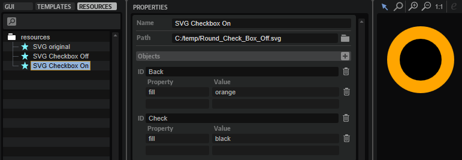

/ [HALion Developer Resource](../../HALion-Developer-Resource.md) / [HALion Tutorials & Guidelines](./HALion-Tutorials-Guidelines.md) / [How-tos](./How-tos.md) /

# Modifying SVGs with Multiple Objects

{{#include ../../_Version.md:halion700}}

---

**On this page:**

[[_TOC_]]

---

## Creating a Checkbox Control

The example below demonstrates how to build a checkbox with two states, the off-state and on-state, from a single SVG file.

### Creating an SVG file

Before you can build the checkbox in HALion, you need an SVG file with the representation of a typical checkbox, e.g. two concentric circles.

1. Create an SVG file, for example with [Inkscape](https://inkscape.org/), an open source SVG editor.
2. Add two concentric circles and name them 'Back' for the background of the checkbox and 'Check' for the dot that indicates the checked state.

By viewing SVG files in a text editor you gain insight about the available objects and their values. If you open the SVG file in a text editor, it might look like this:

3. In HALion, open the Macro Page Designer, add an SVG resource in the **Resources Tree** and set the Path to the SVG file.

In this example, the added [SVG](../../HALion-Macro-Page/pages/SVG.md) resource is named 'SVG original' and looks the same as in the SVG editor.

### Adding Objects

To edit the objects, you must enter the ID of the object, the property you want to change and the corresponding values. If an SVG file contains more than one object, these objects and their properties can be added for further editing like this.

1. Go to the **Resource Tree** and select the [SVG](../../HALion-Macro-Page/pages/SVG.md) resource your want to edit.
1. In the **Objects** line, click **+**.
1. Set the **ID** of the additional object.
1. Set the properties and values of the object.

### Creating Multiple Checkbox States

#### Prerequisites.

* A program with a macro page.

#### Creating the Checkbox States

1. Duplicate the [SVG](../../HALion-Macro-Page/pages/SVG.md) resource 'SVG original' and name it 'SVG Checkbox Off'.
1. In the 'SVG Checkbox Off' resource, add the objects 'Back' and 'Check' as described above in [Adding Objects](#adding-objects).
1. Adapt the look to your liking. In this example, 'Back' is set to ``fill`` and ``orange`` and 'Check' is set to ``fill`` and ``rgba (0,0,0,0.4)`` which is black with an opacity of 40 %.

1. Duplicate the [SVG](../../HALion-Macro-Page/pages/SVG.md) resource 'SVG Checkbox Off' and name it 'SVG Checkbox On'.
1. In the 'SVG Checkbox On' resource, set the ``fill`` property of the 'Check' circle to ``black``.

1. In the **GUI Tree**, add a [Switch](../../HALion-Macro-Page/pages/Switch.md) control and set its Mode to 'onoff'.
1. Assign the 'SVG Checkbox Off' and 'SVG Checkbox On' resources to the Bitmaps Off and On, respectively.

If you want, you can create more variants to implement additional hover-state resources, for example.
