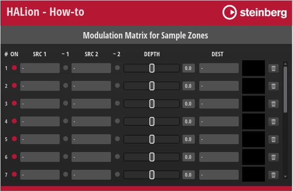

/ [HALion Developer Resource](../../HALion-Developer-Resource.md) / [HALion Tutorials & Guidelines](./HALion-Tutorials-Guidelines.md) / [How-tos](./How-tos.md) /

# Modulation Matrix for Sample Zones

This how-to provides a modulation matrix for sample zones that you can use as an example to create your own.

For other zone types, see [Modulation Matrix for FM Zones](./Modulation-Matrix-for-FM-Zones.md), [Modulation Matrix for Grain Zones](./Modulation-Matrix-for-Grain-Zones.md), [Modulation Matrix for Spectral Zones](./Modulation-Matrix-for-Spectral-Zones.md), [Modulation Matrix for Synth Zones](./Modulation-Matrix-for-Synth-Zones.md), and [Modulation Matrix for Wavetable Zones](./Modulation-Matrix-for-Wavetable-Zones.md).

## Example VST Preset

[Modulation Matrix for Sample Zones](../vstpresets/Modulation%20Matrix%20for%20Sample%20Zones.vstpreset)

## How the Elements Interact

The modulation matrix is provided as-is, without detailed explanation. If you want to understand the inner workings of this modulation matrix, see [Creating a Modulation Matrix](./Creating-a-Modulation-Matrix.md).
