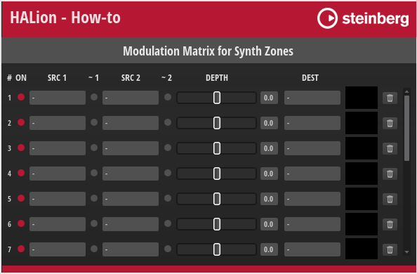

/ [HALion Developer Resource](../../HALion-Developer-Resource.md) / [HALion Tutorials & Guidelines](./HALion-Tutorials-Guidelines.md) / [How-tos](./How-tos.md) /

# Modulation Matrix for Synth Zones

This how-to provides a modulation matrix for synth zones that you can use as an example to create your own.

## Example VST Preset

[Modulation Matrix for Synth Zones](../vstpresets/Modulation%20Matrix%20for%20Synth%20Zones.vstpreset)

The following section describes how to access [Templates](../../HALion-Macro-Page/pages/Template.md) and edit UI scripts.

* Load [Modulation Matrix for Synth Zones](../vstpresets/Modulation%20Matrix%20for%20Synth%20Zones.vstpreset).

{{#include ./_Excerpts.md:to-explore-templates}}

{{#include ./_Excerpts.md:to-edit-ui-scripts}}

## Prerequisites

* A program with a layer, a zone and a macro page.

## How the Elements Interact

The modulation matrix is provided as-is, without detailed explanation. If you want to understand the inner workings of this modulation matrix, see [Creating a Modulation Matrix](./Creating-a-Modulation-Matrix.md).

