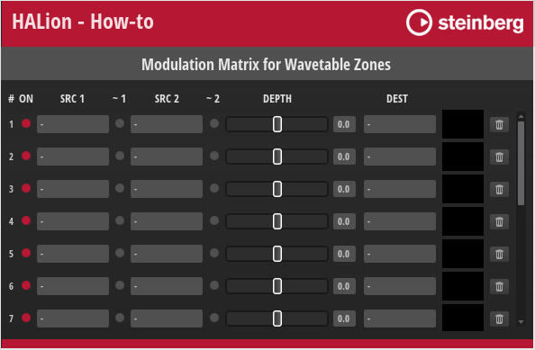

/ [HALion Developer Resource](../../HALion-Developer-Resource.md) / [HALion Tutorials & Guidelines](./HALion-Tutorials-Guidelines.md) / [How-tos](./How-tos.md) /

# Modulation Matrix for Wavetable Zones

This how-to provides a modulation matrix for Wavetable zones that you can use as an example to create your own. There are no modulation source or destination controls on the macro page, only the modulation matrix with its controls, and the UI and MIDI scripts. The main focus is on the selection of modulation destinations, which have been chosen in accordance with the Wavetable zone.

For a modulation matrix that matches a different zone type, see [Modulation Matrix for FM Zones](./Modulation-Matrix-for-FM-Zones.md), [Modulation Matrix for Grain Zones](./Modulation-Matrix-for-Grain-Zones.md), [Modulation Matrix for Sample Zones](./Modulation-Matrix-for-Sample-Zones.md), [Modulation Matrix for Spectral Zones](./Modulation-Matrix-for-Spectral-Zones.md), and [Modulation Matrix for Synth Zones](./Modulation-Matrix-for-Synth-Zones.md).

## Example VST Preset

[Modulation Matrix for Wavetable Zones](../vstpresets/Modulation%20Matrix%20for%20Wavetable%20Zones.vstpreset)

## How the Elements Interact

The modulation matrix is provided as-is, without detailed explanation. The [Creating a Modulation Matrix](./Creating-a-Modulation-Matrix.md) tutorial explains how this modulation matrix works.