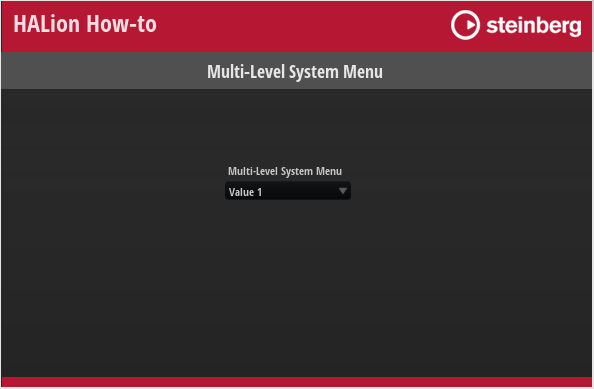
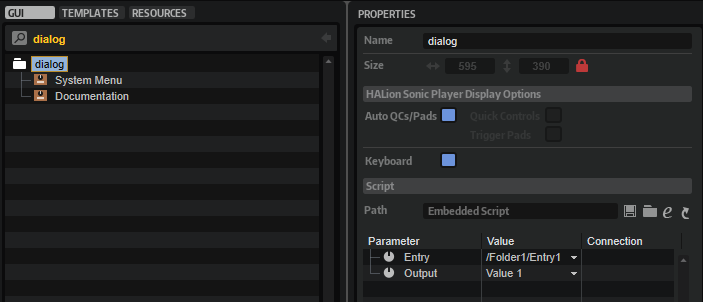
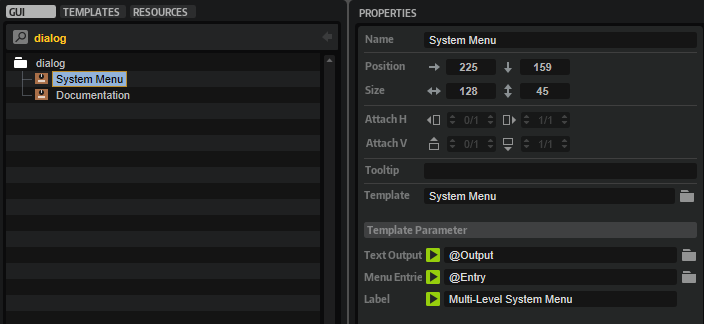

/ [HALion Developer Resource](../../HALion-Developer-Resource.md) / [HALion Tutorials & Guidelines](./HALion-Tutorials-Guidelines.md) / [How-tos](./How-tos.md) /

# Multi-Level System Menus

---

**On this page:**

[[_TOC_]]

---

For most applications, standard menus are well suited to select options from a list of strings, e.g., a menu that contains various filter types. If the number of entries is too high, one loses the overview and a subdivided menu would be advantageous. To achieve a subdivided menu, you must implement the menu entries as a stringlist parameter with strings in the following notation:

``/Folder/Subfolder/../Menu Entry``

Please see the example below for details.

>&#10069; This how-to demonstrates multi-level menus using the generic look of the operating system. If you want to create menus with a customized look, please refer to [Custom Multi-Level Menus](./Custom-Multi-Level-Menus.md), [Custom Multi-Level Menus II](./Custom-Multi-Level-Menus-II.md) or [Custom Popup Menus](./Custom-Popup-Menus.md).

## Example VST Preset

[Multi-Level System Menu.vstpreset](../vstpresets/Multi-Level%20System%20Menu.vstpreset)



**To explore the templates in this example:**

1. Load [Multi-Level System Menu.vstpreset](../vstpresets/Multi-Level%20System%20Menu.vstpreset).
1. Open the **Macro Page Designer**, go to the **Templates Tree** and select the template you want to explore. 
1. Click **Edit Element**  to examine the template.

## Prerequisites

* A macro page with a [Menu](../../HALion-Macro-Page/pages/Menu.md), a [Text](../../HALion-Macro-Page/pages/Text.md), and a [Label](../../HALion-Macro-Page/pages/Label.md) control, optionally combined as a template.
* A MIDI or UI script that provides parameter definitons and functions

## Defining Parameters for the Menu

The following code example shows how to create the menu entries and the resulting display string using a UI script.

### Example

```lua
 -- Create tables for menu entry strings and display output strings
entry_and_output = {
    { "/Folder1/Entry1", "Value 1" },
    { "/Folder1/Entry2", "Value 2" },
    { "/Folder2/Entry1", "Value 3" },
    { "/Folder2/Entry2", "Value 4" },
}
entries = {}
outputs = {}
for i,v in ipairs(entry_and_output) do
 entries[i] = v[1]
 outputs[i] = v[2]
end
-- Define the parameter "Entry" to be connected to a menu control and the parameter "Output" to display the selected menu entry
defineParameter("Entry", nil, 1, entries, function() Output = Entry end)
defineParameter("Output", nil, 1, outputs)
```

In the [Example VST Preset](#example-vst-preset) the UI script is attached to the macro page.



## System Menu

The System Menu contains the elements that are needed to display the selected value. The template parameters Text Output and Menu Entries must be connected to the corresponding parameters ``@Output`` and ``@Entry`` of the UI script.



In this example the Output parameter is not connected to a physical parameter. To set the value of the desired parameter, the Output parameter of the UI script must be connected to the respective parameter in the program.
