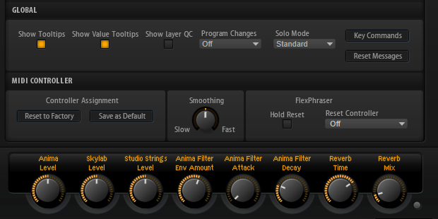
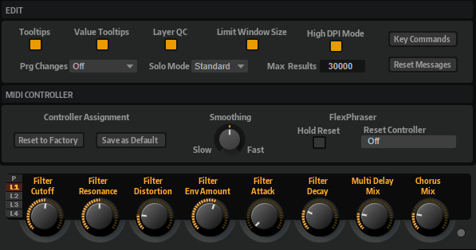

# Quick Controls Guideline

---

**On this page:**

[[_TOC_]]

---

In previous releases of HALion Sonic (< 3.0.10), parameters of layers could only be assigned to layer quick controls and direct assignments to program quick controls were not possible. This restraint was removed for more flexibility and to simplify the sound design process.

## Show Layer QC

On HALion Sonic's **Options** page , there is a new option in the Global section: **Show Layer QC**.

If **Show Layer QC** is switched off:

* The quick control section shows only the program quick controls.
* New quick control assignments can only be made for the Program.

If **Show layer QC** is switched on:

* The quick control section of HALion Sonic shows program or layer quick controls. You can switch between those quick controls using the buttons on the left.
* New quick control assignments can be made for the Program or for Layers 1-4.

By default, Show Layer QC is switched off.

## Quick Controls Conventions

* If possible, all quick controls of the Program should be assigned. They can be used to control the most important parameters of the insert effects, for example.
* Please also assign the sphere control of the Program. Try to keep the sphere always centered. This way, the user can default the sphere, if needed. This is not possible if the sphere has an offset from its center position.
* The quick controls and spheres of the layers do not have to be assigned. They can be left empty.
* The quick controls should be assigned from left to right with no empty quick controls in between.
* Sound parameters should be assigned to the first quick controls (QC 1 to QC 4) and effect parameters should be assigned to the last quick controls (QC 5 to QC 8).
* Keep the layout of the quick control assignments consistent. For example, if you assign Filter Cutoff and Fitler Resonance for all your presets, always assign them to the same quick controls.
* Assign effect parameters in groups with the Mix parameter as last quick control assignment. For example, like this:

|[...]|QC5|QC6|QC7|QC8|
|:-|:-|:-|:-|:-|
|[...]|Delay Time|Delay Mix|Reverb Time|Reverb Mix|