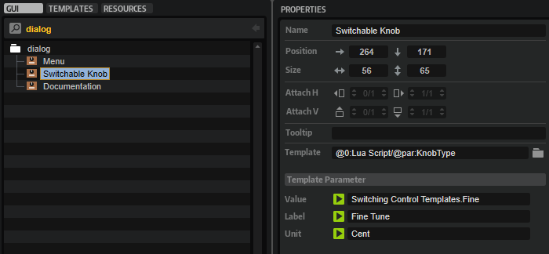

# Switching Control Templates

---

**On this page:**

[[_TOC_]]

---

Usually, parameters are connected to specific controls that have a certain look which never changes during the usage of the macro page. However, in some cases it might be useful to be able to change the look at runtime, either to allow the user to choose between different styles, or because one editor template is used to edit different objects (using different scopes) which should be indicated by different controls. A simple example would be a template that provides several knobs to control oscillators 1, 2, and 3 of a synth zone, where each set of knobs should have a different color to better distinguish between them.

This example demonstrates how to use a Lua Script MIDI module with a KnobType parameter to switch between two different knob templates. The parameter is defined in a MIDI module, which saves and restores the state with the preset. 

>&#10069; If it is not desired to save and restore the KnobType with the preset, but only with a project, you can implement this parameter in a UI script.

## Example VST Preset

[Switching Control Templates.vstpreset](../vstpresets/Switching%20Control%20Templates.vstpreset)

## Prerequisites

* A macro page with a Switchable Knob template.
* A MIDI module script with a KnobType parameter.
* Two knob templates: KnobLC1 and Knob BB.
* A Menu template to select the knob template that should be displayed.



## Connecting the Controls

1. Add a Lua Script MIDI module to the program and define the parameter KnobType.

```lua
defineParameter{
    name = "KnobType",
    default = 1,
    strings = { "Knob BB", "Knob LC1" },
}
```

2. Edit the knob templates and export the parameters that you want to use on the template level, e.g., Value, Label, Text.
2. Connect the Switchable Knob template with the script parameter by setting its Template property to ``@0:Lua Script/@par:KnobType``.
2. Connect the Menu template with the script parameter by setting its Value property to ``@0:Lua Script/@par:KnobType``.
2. Connect the Value of the Switchable Knob template to an engine parameter.

**Result:** You can use the menu to switch the template reference between Knob LC1 and Knob BB. If you save the program,
the knob type is saved and restored with the preset.
