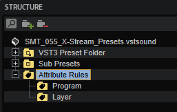
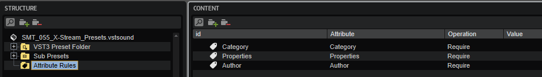
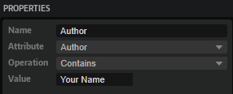
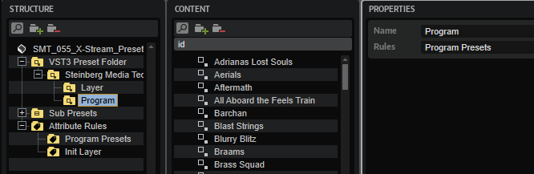
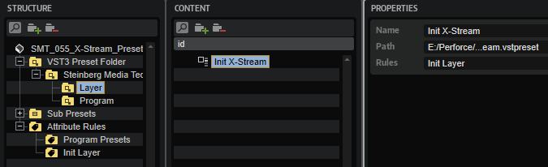

/ [HALion Developer Resource](../../HALion-Developer-Resource.md) / [HALion Tutorials & Guidelines](./HALion-Tutorials-Guidelines.md) / [Tutorials](./Tutorials.md) /

# Using Attribute Rules

{{#include ../../_Version.md:halion710}}

---

**On this page:**

[[_TOC_]]

---

## MediaBay Attributes

MediaBay attributes are a quick and easy way to browse and search presets. Attributes are descriptive keywords that you can assign to your presets. Good search results in the MediaBay are highly dependent on correctly set attributes. With a large number of presets, it can be difficult to verify that MediaBay attributes are correct. The Library Creator provides features that allow you to set, delete or check MediaBay attributes during library creation.

## Attribute Rules

**Attribute Rules** is a special node that can be added to a VST Sound in the **Structure** section. Within the **Attribute Rules** node, you can create a set of rules and commands for setting, deleting and testing MediaBay attributes.

The top node **Attribute Rules** cannot be renamed. You can create additional **Attribute Rules** nodes within the top node. These additional nodes define a subset of rules. Additional nodes can be renamed and referenced by that name, for example, to define separate rules for program and layer presets.

## Attribute Rule

An **Attribute Rule** can only be created within an **Attribute Rules** node. An **Attribute Rule** defines the rules and actions to be exectued for a certain MediaBay attribute. You must create an **Attribute Rule** for each desired rule and action.

## Prerequisite

For this tutorial, you need a library with a VST Sound that contains program and/or layer presets.

## Adding an Attribute Rules Node

1. In the **VST Sound Container** section, select the **VST Sound** that contains the program presets of your library.
1. In the toolbar of the **Structure** section, click **Add**.
1. Select **Attribute Rules > Create Attribute Rules**.

An **Attribute Rules** node is added to the structure of the VST Sound. This node has no function. It serves only as a container for the actual rules and actions.

## Creating an Attribute Rule

1. In the **Structure** section, select the **Attribute Rules** node.
1. In the toolbar of the **Content** section, click **Add**.
1. Select **Attribute Rule**.

An **Attribute Rule** is added to the **Content** section. The **Attribute Rule** you just created has no function yet. It must be assigned to an attribute and the desired operation must be selected.

## Setting Attribute Rule Properties

1. In the **Content** section, select the **Attribute Rule** you want to edit. The current set of rules and actions are displayed in the **Properties** section to the right.
1. Open the **Attribute** menu and select the desired attribute.
1. Open the **Operation** menu and select the desired action for the selected attribute.
1. Enter a **Value** for the selected operation, if needed.

### Attribute Property

The **Attribute** property defines to which attribute the **Attribute Rule** applies. To learn more about the different attributes of MediaBay, see the [MediaBay Guideline](./MediaBay-Guideline.md).

### Operation Property

The **Operation** of an **Attribute Rule** defines the action to be performed on the selected attribute. The Library Creator checks each preset if the rule applies and performs the defined action or reports an error during building the library.

|Operation|Description|
|:-|:-|
|**Require**|The attribute must be set.|
|**Reject**|The attribute must not be set.|
|**Contains**|The attribute must contain the set value.|
|**Set**|The attribute is set to the defined value.|
|**Clear**|The attribute will be deleted.|

## Investigating Errors

A red warning sign next to a content file indicates errors before the library is built.

* Click the red warning sign to open a report of the errors and investigate them.

>&#10069; The library is built only if the defined set of rules and actions can be executed without errors.

## About the Scope of an Attribute Rule

The scope defines to which presets an **Attribute Rule** applies. By default, any **Attribute Rule** that is defined in the top node **Attribute Rules** applies to all presets within the VST Sound. You can change the scope by creating an additional **Attribute Rules** node within the top node. This additional node can be used to define a subset of rules. The additional node can be renamed and referenced by that name. The subset of rules and actions apply only to the presets that reference the additional **Attribute Rules** node.

### Creating Additional Attribute Rules

1. In the **Structure** section, create the **Attribute Rules** node and select it.
1. Within the selected node, create another **Attribute Rules** node.
1. Rename the **Attribute Rules** node you have just created.
1. Add an **Attibute Rule**, see [Creating an Attribute Rule](#creating-an-attribute-rule).
1. Repeat the last step until you have the desired set of rules.

### Assigning a Subset of Attribute Rules

1. In the **Structure** section, select the **VST3 Preset Folder**. The **Name** and **Rules** properties are displayed in the **Properties** section to the right.
1. Navigate to the folder that contains the presets to which you want to apply the subset of attribute rules.
1. Enter the name of the **Attribute Rules** node as reference for the **Rules** property.

You can even assign a subset of attribute rules to single presets.

1. Navigate to the desired preset.
1. Set the **Rules** property to the name of the **Attribute Rules** node you want to reference.

## Attribute Rules for Other Media Types

In addition to VST3 presets, you can create attribute rules also for other media types that support MediaBay attributes, for example, audio and MIDI files.

>&#10069; The Private Audio Files folder hides samples from MediaBay. Therefore, attribute rules cannot be applied to samples in the Private Audio Files folder. Only samples in the Public Audio Files folder are visible to MediaBay. For this reason, attribute rules can only be applied to samples in the Public Audio Files folder. 

1. In the **Structure** section, select **Public Audio Files** or **MIDI Files**, depending on the media type. The **Name** and **Rules** properties are displayed in the **Properties** section to the right.
1. Navigate to the folder that contains the content to which you want to apply the subset of attribute rules.
1. Enter the name of the **Attribute Rules** node as reference for the **Rules** property.

## Attribute Rules Presets

You can save and load presets for any **Attribute Rules** node. The preset saves all the rules for the selected node. Loading a preset restores these rules for the node where you load it.

### Saving Attribute Rules

1. In the **Structure** section, select the **Attribute Rules** node that you want to save.
1. In the toolbar of the **Content** section, click **Add**.
1. Select **Save Preset**.
1. Enter a meaningful name for your attribute rules and click **Save**.

### Loading Attribute Rules

1. In the **Structure** section, select the node for which you want to load the preset. This can be the node of the VST Sound or an **Attribute Rules** node.
1. In the toolbar of the **Structure** section, click **Add**.
1. Go to **Attribute Rules > Load Preset** and select the preset that you want to load.

### Deleting Attribute Rules

1. In the toolbar of the **Structure** section, click **Add**.
1. Go to **Attribute Rules > Delete Preset** and select the preset that you want to delete.

## Example

Using different rules for program presets and the Init layer preset.

1. In the **Structure** section, create the **Attribute Rules** node and select it.
1. Within the selected node, create two more **Attribute Rules** nodes.
1. Rename the **Attribute Rules** nodes you have just created to "Program Presets" and "Init Layer" respectively.
1. Create different rules for your program presets and the Init layer preset.
1. Navigate to the VST3 preset folder that contains the program presets.
1. In the **Properties** section to the right, set the **Rules** property to "Program Presets".

7. Navigate to the VST3 preset folder that contains the Init layer preset and select it
7. In the **Properties** section to the right, set the **Rules** property to "Init Layer".

The **Library Creator** scans each preset to verify whether the referenced rules apply and performs the defined action or reports an error when building the library.
