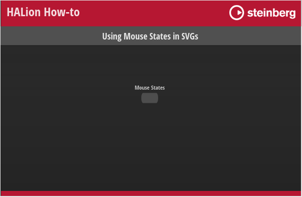

/ [HALion Developer Resource](../../HALion-Developer-Resource.md) / [HALion Tutorials & Guidelines](./HALion-Tutorials-Guidelines.md) / [How-tos](./How-tos.md) /

# Using Mouse States in SVGs

{{#include ../../_Version.md:halion700}}

---

**On this page:**

[[_TOC_]]

---

You can use variables related to mouse actions to modify a [SVG](../../HALion-Macro-Page/pages/SVG.md) resource that is assigned to a [Switch](../../HALion-Macro-Page/pages/Switch.md) control. The advantage is that you don't have to assign separate resources to the different states of a [Switch](../../HALion-Macro-Page/pages/Switch.md) control to indicate its current state. The indication of a particular state is defined within the [SVG](../../HALion-Macro-Page/pages/SVG.md) resource itself using Lua expressions. Please note that this cannot be used in combination with animations, as these are only executed when switching between the different states of a switch and the assigned resources.

>&#10069; See [Animating Switches Using SVGs](./Animating-Switches-Using-SVGs.md) for details on using animations with [Switch](../../HALion-Macro-Page/pages/Switch.md) controls.

## Defining Mouse States

The mouse states are defined in the [SVG](../../HALion-Macro-Page/pages/SVG.md) resource properties by using Lua expressions. {{#include ./_Lua-Expressions.md:paragraph1}}

You can use the following variables in Lua expressions:

|Variable|Description|
|:-|:-|
|**On**|The on-state of the switch.|
|**Down**|The down-state of the switch.|
|**Hover**|The hover-state of the switch.|

## Using Mouse States

{{#include ./_Excerpts.md:single-example}}

### Example VST Preset

* [Using Mouse States in SVGs.vstpreset](../vstpresets/Using%20Mouse%20States%20in%20SVGs.vstpreset)

**To explore the template in this example:**

1. Load [Using Mouse States in SVGs.vstpreset](../vstpresets/Using%20Mouse%20States%20in%20SVGs.vstpreset).
1. Open the **Macro Page Designer**, go to the **GUI Tree** and select the 'SVG Mod Switch' template. 
1. Click **Edit Element**  to examine the template.
1. Inside the template, select the [Switch](../../HALion-Macro-Page/pages/Switch.md) control. Take a look at which [Bitmap](../../HALion-Macro-Page/pages/Bitmap.md) resource has been assigned to the off-state of the switch.
1. Go to the **Resources Tree** and select the corresponding [SVG](../../HALion-Macro-Page/pages/SVG.md) resource. Take a look at the IDs, properties and values as listed below.

### Indicating Mouse States

#### Mouse States

**Resources:** SVGMod_Rect SW.

|ID|Property|Value|
|:-|:-|:-|
|Rect|fill|``hsla(154,$(0+On*40)%,$(30+Hover*20+On*20)%,1)``|

**Description:** Each state of the switch shows a different color, including the hover-states for the on- and off-states.
