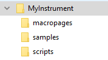
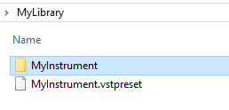

/ [HALion Developer Resource](../../HALion-Developer-Resource.md) / [HALion Tutorials & Guidelines](./HALion-Tutorials-Guidelines.md) / [Tutorials](./Tutorials.md) /

# Using Relative Paths

---

**On this page:**

[[_TOC_]]

---

## Abolute Paths vs. Relative Paths

Absolute paths use the full file path starting from the root directory of your system. If the source files of your library use absolute paths, you have to relocate them when moving the library to another directory or system. If you work in a team and you need to share your library with your teammates, you must work with relative paths. Relative paths start from a specific working directory, avoiding the need to provide the full file path. If the source files of your library use relative paths, you can move the library to another directory or system without having to relocate the files. Therefore, it is recommended to work with relative paths when creating libraries.

## Creating a Working Directory

Libraries and their source files can be moved and shared easily if you keep all files in one place: your working directory. It is recommended that you create one working directory for each library. This directory contains the required subfolders for the different types of source files. Typical subfolders are: VST presets, macropages, samples, scripts, etc. The working directory can be located anywhere on your system.

* To create a working directory and subfolders, use the file browser of your system.

A typical folder structure could look like this:



## Achieving Relative Paths

### Overview of Workflows

* To export the VST preset to the working directory, you must use Export Program as VST3 Preset...
* Place the source files in the subfolders of the working directory and load them from there.
* Load the source files from any location, then export them into the respective subfolders of the working directory using one of HALion's export functions. There are different functions for exporting samples, macro pages, etc. Then relocate the files with a replace function or load them from their new location.

The different workflows will be explained in detail below.

>&#10069; You cannot create a working directory simply by moving the VST preset and all source files into one directory, because the file paths within the VST preset still point to the locations of the source files that were used when you saved the preset.

### Exporting VST Presets to the Working Directory

If you want to save your VST preset for the first time, you might be tempted to use **Save Program** or **Save Program As...** The save functions only allow to save in the default location for VST presets. However, the default location is scanned by the MediaBay and is therefore not the adequate location for working directories. The export function allows to choose the location freely. You must use **Export Program as VST3 Preset...** at least once to export your VST preset to the working directory. After loading the exported VST preset from the working directory, you can save your VST preset using the **Save Program** command or the export function. **Save Program** will not ask for a location or file name if the preset was loaded from the working directory.

To achieve relative paths for your VST preset:

1. Export the VST preset with **Export Program as VST3 Preset...** to the working directory.
1. Load the VST preset from the working directory.

From now on, you can either use **Save Program** or the export function to save your VST preset.

>&#10069; If you are working on a HALion Sonic library, you usually want to save HALion Sonic Layers and not HALion Programs. In this case **Save Program** cannot be used and you must use **Export Program as VST3 Preset...** with the options **As HS Layer** and **Verify** activated.

### Using Source Files from the Working Directory

A practical way to achieve relative paths for your library is to place the source files, e.g., samples, bitmaps, scripts, etc., in the working directory before loading them. This is especially recommended if you already know which files you want to use in your library.

* Place the source files in the subfolders of the working directory and load them from there.

>&#10069; Do not forget to save or export your VST preset after adding new ressources to it.

## Using Export Program as VST3 Preset... with Export Files

**Export Program as VST3 Preset...** with **Export Files** allows you to create a working directory and export all the required files to it in a single operation.

1. In the **Program Tree**, right-click the program and select **Import/Export > Export Program as VST3 Preset...**
1. Activate **Export files**.
1. If you are working on a HALion Sonic library, activate **As HS Layer** and **Verify**.
1. Choose a location and a file name. The location becomes your working directory. The file name should correspond to the name of your instrument.
1. Click **OK** to start the export.

HALion now creates a VST preset and several subfolders in the working directory. The subfolders store all the ressources that were in use when you exported the program.



Subfolders containing ressources typically look like this:


To activate the relative paths, you must load the exported VST preset:

* Load the exported preset from the working directory. It uses only the exported files in the respective subfolders.

## Moving a Library

If you need to move the library to a new location, you must move the whole working directory with contents. As long as you do not change the folder structure inside the working directory, HALion will be able to load your library, even after moving it.

## Achieving Relative Paths in Script

Functions like [loadPreset](../../HALion-Script/pages/loadPreset.md) require a file path as argument. The function ``debug.getinfo`` from the Lua debug library returns the file path of the running script. You can use this information to create a relative file path for your script. The folders in the if branch of the following script example must match the working directory on your hard disk. How to create a working directory is described in [Using Relative Paths](#using-relative-paths). The folders in the else branch must match the folders that you specified in the **Library Creator**. If the folder on the hard disk cannot be found, the file path of the VST sound will be used instead. Note that the VST sound must be mounted for this to work.

### Example

```lua
-- Load a sub preset from hard disk or VST sound.
-- Find relative path on hard disk.
local info = debug.getinfo(1,'S') -- Function from the Lua debug library.
local source = info.source
local pos = string.find(source, "/library/") -- Assumes the folder "/library/" contains subfolders like "/samples/", "/scripts/", "/VST3 Sub Presets/", etc.
if pos then
    contentPath = string.sub(source, 1, pos - 1).."/library/VST3 Sub Presets/"  -- The folder on disk with sub presets, for example.
else
    -- Extract VST sound GUID, e.g. "vstsound://ABCDEFGHIJKLMNOPQRSTUVWXYZ123456".
    -- The GUID of the VST sound can be found in the library creator.
    -- "SomeFolderName" is defined in the library creator.
    -- The library creator prepends "/.AppData/Steinberg/" when building the library.
    -- The content must be in the same VST sound as the script.
    contentPath = source:sub(1, 43) .. "/.AppData/Steinberg/SomeFolderName/" -- The location of the sub presets inside the vstsound.
end
 
-- Load the sub preset from the respective contentPath.
layer = loadPreset(contentPath.."SomePreset.vstpreset")
```