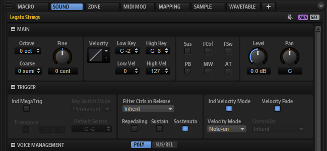
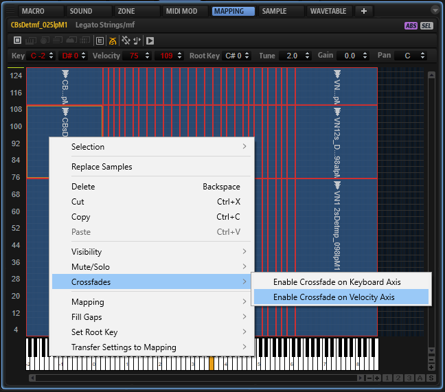
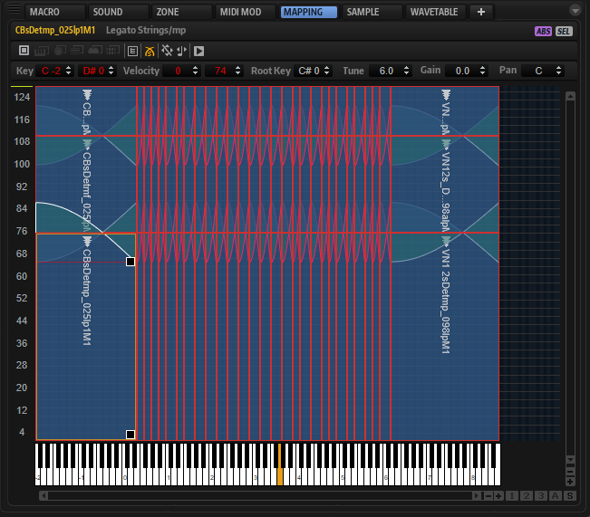
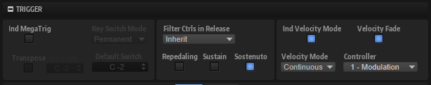
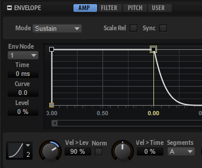
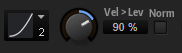
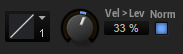

/ [HALion Developer Resource](../../HALion-Developer-Resource.md) / [HALion Tutorials & Guidelines](./HALion-Tutorials-Guidelines.md) / [Tutorials](./Tutorials.md) /

# Using Velocity Crossfades

---

**On this page:**

[[_TOC_]]

---

The sampled velocities of an instrument usually have differences in timbre and level. Velocity crossfades allow you to blend between adjacent velocities for smoothing out these differences, which makes the instrument more playable and the sound more realistic.

## Prerequisite

To set up velocity crossfades, you need a multi-sample with two or more velocity layers. The following example program has three velocity layers.

### Loading the Example VST Preset

1. Download [Using Velocity Crossfades 01.vstpreset](../vstpresets/Using%20Velocity%20Crossfades%2001.vstpreset).
1. Drag the VST preset to the **Slot Rack**.

>&#10069; The example VST preset requires the factory content of HALion.

## Activating Velocity Crossfades

### Overview of Workflows

* **Individual Velocity Mode** and **Velocity Fade** must be activated for the layer containing the zones that you want to crossfade.
* **Enable Crossfade on Velocity Axis** must be activated for all zones that you want to crossfade.
* Adjust the fade handles in the **Mapping** editor using **Crossfade: Symmetric**.

### Activating the Layer

The options **Individual Velocity Mode** and **Velocity Fade** can be found in the **Sound** editor.

1. In the **Program Tree**, select the layer containing the zones that you want to crossfade.
1. Open the **Sound** editor, go to the **Trigger** section and activate **Individual Velocity Mode** and **Velocity Fade**.

### Activating the Zones

The option **Enable Crossfade on Velocity Axis** can be found in the context menu of the **Mapping** editor.

1. Open the **Mapping** editor and select all zones.
1. Right-click a zone and select **Crossfades > Enable Crossfade on Velocity Axis**.

>&#10069; The **Enable Crossfade on Velocity Axis** option is grayed out and cannot be used if **Individual Velocity Mode** or **Velocity Fade** are not activated.

### Adjusting the Velocity Crossfades

Velocity crossfades are adjusted with the fade handles in the **Mapping** editor.

>&#10069; The fade handles are only visible if the options for the layer and zones have been activated, as described above. In addition, the zones must be selected and the zoom level must be high enough.

1. In the toolbar of the **Mapping** editor, activate **Crossfades: Symmetric** .
1. Select the zones that you want to crossfade or select all zones.
1. Zoom in until you see the fade handles.
1. Drag a fade handle to adjust the range of the crossfade.
1. Drag one of the fade lines to adjust the curvature of the crossfade.

## Using the Velocity Options

Once the velocity crossfades are set up in the **Mapping** editor, they can be used. You can crossfade the zones using the note-on velocity or by using the value of a MIDI controller, for example. The different usages are configured with the velocity options in the **Trigger** section of the corresponding layer. Which settings you must use depends on the requirements of your content. The following table lists the different requirements and the settings for the velocity options.

|#|Content Requirements|Velocity Mode|Velocity Fade|Description|
|:-|:-|:-|:-|:-|
|1|<ul><li>Timbre and level only need to change at the note-on.</li><li>Crossfades are not required.</li></ul>|Note-on|Off|<ul><li>Only the zones that belong to a specific note and velocity will be triggered.</li><li>The crossfades in the **Mapping** editor are not applied (velocity switching).</li><li>The level of the triggered zones is set at the note-on.</li></ul>|
|2|<ul><li>Timbre and level only need to change at the note-on.</li><li>Crossfades are required.</li></ul>|Note-on|On|<ul><li>Only the zones that belong to a specific note and velocity will be triggered.</li><li>If the velocity lies within a crossfade, the crossfading zones will be triggered simultaneously.</li><li>The crossfades in the **Mapping** editor are applied at the note-on (velocity crossfading).</li><li>The level of the triggered zones is set at the note-on.</li></ul>|
|3|<ul><li>Timbre only needs to change at the note-on.</li><li>Level needs to change also after the note-on.</li><li>Crossfades are not required.</li></ul>|Controller|Off|<ul><li>The velocity of the note-on event is replaced by the value of the MIDI controller.</li><li>Only the zones that belong to a specific note and velocity will be triggered.</li><li>The crossfades in the **Mapping** editor are not applied (velocity switching).</li><li>After the note-on, the MIDI controller cannot switch between the velocities.</li><li>The MIDI controller can change the level of the triggered zones, even after the note-on.</li></ul>|
|4|<ul><li>Timbre only needs to change at the note-on.</li><li>Level needs to change also after the note-on.</li><li>Crossfades are required.</li></ul>|Controller|On|<ul><li>The velocity of the note-on event is replaced by the value of the MIDI controller.</li><li>Only the zones that belong to a specific note and velocity will be triggered.</li><li>If the velocity lies within a crossfade, the crossfading zones will be triggered simultaneously.</li><li>The crossfades in the **Mapping** editor are applied at the note-on (velocity crossfading).</li><li>After the note-on, the MIDI controller cannot crossfade between the velocities.</li><li>The MIDI controller can change the level of the triggered zones, even after the note-on.</li></ul>|
|5|<ul><li>Timbre and level need to change freely.</li><li>Crossfades are not required..</li></ul>|Continuous|Off|<ul><li>The velocity of the note-on event is replaced by the value of the MIDI controller.</li><li>All zones that belong to the same note are triggered simultaneously, regardless of their velocity.</li><li>The crossfades in the **Mapping** editor are not applied (velocity switching).</li><li>The MIDI controller can switch between the velocities of the triggered zones and change their level, even after the note-on.</li></ul>|
|6|<ul><li>Timbre and level need to change freely.</li><li>Crossfades are required.</li></ul>|Continuous|On|<ul><li>The velocity of the note-on event is replaced by the value of the MIDI controller.</li><li>All zones that belong to the same note are triggered simultaneously, regardless of their velocity.</li><li>The crossfades in the **Mapping** editor are applied (velocity crossfading).</li><li>The MIDI controller can crossfade between the velocities of the triggered zones and change their level, even after the note-on.</li></ul>|

We will use Velocity Mode Continuous and Velocity Fade On for the example VST preset.

1. In the **Program Tree**, select the layer on which you activated the **Individual Velocity Mode** and **Velocity Fade** options.
1. Open the **Sound** editor, go to the **Trigger** section and set **Velocity Mode** to "Continuous" and **Controller** to ""Modulation Wheel"".

* Play a note and use the modulation wheel.

## Setting the Level Velocity

The overall dynamic range and response is determined by the **Level Velocity** settings of the amplitude envelope of the zone.

Depending on whether your samples are normalized or not, there are two basic concepts for setting up the level velocity.

**If your samples are normalized:**

1. Choose a **Level Velocity Curve**. The Squared velocity curve is the most commonly used curve.
1. Adjust the dynamic range with the **Level Velocity** parameter. The higher the value, the greater the dynamic range.

With these settings, the dynamic range and response is mainly determined by the level velocity settings of the zones.

**If your samples are not normalized:**

1. Set the **Level Velocity Curve** to Linear.
1. Activate **Use Normalized Velocity**.
1. Increase the **Level Velocity** parameter for each velocity layer only as much as necessary until the crossfades sound smooth.

With these settings, the dynamic range and response is determined by the combination of the gains of the samples and the Level Velocity settings of the zones.

## Fine-Tuning the Velocity Crossfades

To make the crossfades as seamless as possible, the pitches and the levels of the samples must match as closely as possible. For example, you might hear flanging or breaks in the level during the crossfade if the pitches and the levels of adjacent samples do not match. In the **Mapping** editor, you can adjust the pitch and the level for each sample individually.

1. Go to the **Mapping** editor and select the sample that you want to adjust.
1. Adjust the **Tune** and **Gain** parameters until the crossfade of adjacent samples sounds smooth.

### Tips for adjusting the Pitches of the Samples

The velocity fades should be activated while adjusting the pitches.

1. Play a note with a velocity within the range of a crossfade.
1. Adjust the pitches of the adjacent samples until the flanging is minimized or gone.

### Tips for adjusting the Gains of the Samples

When using normalized samples, it can be useful to switch off any velocity fades and level velocity settings while adjusting the gains in the **Mapping** editor.

1. In the **Program Tree**, select the layer on which you activated the **Individual Velocity Mode** and **Velocity Fade** options.
1. Open the **Sound** editor, go to the **Trigger** section and deactivate the **Velocity Fade** option.
1. Open the **Zone** editor, go to the amplitude envelope and set **Level Velocity** to 0%.

Now, you hear only the differences in level and timbre between adjacent samples.

* In the **Mapping** editor, adjust the sample gains until you hear only changes in timbre.

Once you are happy with the gains, activate the **Velocity Fade** option on the layer and set the **Level Velocity** of the zones as desired.

## Example VST Preset

In the example VST preset, the pitch and gain of each zone were adjusted in the **Mapping** editor - for smoother crossfades.

1. Download [Using Velocity Crossfades 02.vstpreset](../vstpresets/Using%20Velocity%20Crossfades%2002.vstpreset).
1. Drag the preset to the Slot Rack.
1. Play a note and use the modulation wheel.