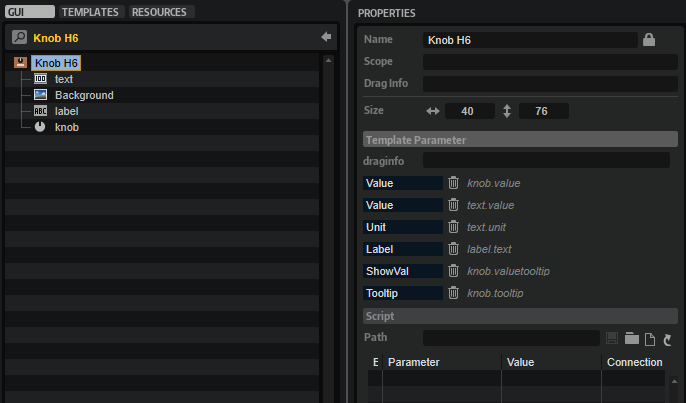

/ [HALion Developer Resource](../../HALion-Developer-Resource.md) / [HALion Tutorials & Guidelines](./HALion-Tutorials-Guidelines.md) / [Tutorials](./Tutorials.md) /

# Working with Exported Properties

---

**On this page:**

[[_TOC_]]

---

When creating universally reusable control templates, it is necessary to export all control properties that need to be accessible on the template level from the controls that are located inside the template.

The properties that can be exported have an **Export Property** option . The parameter is exported if this option is activated. You can see all exported parameters by selecting the topmost element in the **GUI Tree** of the template. The following screenshot shows this for the Knob H6 template from the [Basic Controls](../../HALion-Macro-Page/pages/Exploring-Templates.md#basic-controls) library.

## Prerequisites

* A program with a macro page.

## Creating a Simple Template

1. Go to the **Macro Page Designer**, create a [Knob](../../HALion-Macro-Page/pages/Knob.md) control on the macro page and assign an animation bitmap.

>&#10069; If you do not have an animation bitmap at hand: You can add temporarily a knob template from the [Basic Controls](../../HALion-Macro-Page/pages/Exploring-Templates.md#basic-controls) or [Additional Controls](../../HALion-Macro-Page/pages/Exploring-Templates.md#additional-controls) libraries. This adds the necessary resources and you can assign the respective animation bitmap to your knob.

2. Select the [Knob](../../HALion-Macro-Page/pages/Knob.md) control in the **GUI Tree**, open the context menu and select **Create template 'Knob' from 'Knob'**.
2. In the **GUI Tree** of the template, change the name of the topmost element to "MyKnob".
2. Select the [Knob](../../HALion-Macro-Page/pages/Knob.md) control and export the **Value** property by clicking **Export Property** .
2. Select "MyKnob" in the **GUI Tree** and give the **Value** parameter in the Template Parameter section a meaningful name, e.g., "Value".
2. Go back to the **GUI Tree** of the macro page by clicking  **Switch back to Macro Page/Parent Template** .

**Result:** You have created a simple knob template with a **Value** parameter.

You can add further elements such as labels and text fields to the template and export their relevant parameters, too. Giving exported parameters the same name will combine them on the template level. This way, the template shows a single Value parameter on template level, which could be connected with a knob and a text control inside the template, for example. For more suggestions, try out the knob templates that come with the [Basic Controls](../../HALion-Macro-Page/pages/Exploring-Templates.md#basic-controls) and [Additional Controls](../../HALion-Macro-Page/pages/Exploring-Templates.md#additional-controls) libraries.

## Connecting Template Parameters

You can connect template parameters like parameters of standard controls. There are multiple ways you can do this:

* Drag and drop an engine or script parameter from the parameter list to the template parameter.
* Open the context menu on a HALion control and select **Connect to Macro Page**, then do the same for the template and select **Connect to Parameter '...'** or open the context menu on the Value property and select **Connect to Parameter '...'**.
* Type in ``@example`` to connect the template to a script parameter or a UI variable of that name.
* Type in a path to layers, zones, busses, etc., for example, ``@type:zone/@id:nn``

## Changing the Template While It Is Connected

You can exchange the used template at any time, even if it has already been connected. For this, change the template reference in the **Template Parameter** section in the **Properties** view.

* If the newly assigned template shares the same parameters, the connections remain intact.
* If the new template does not use the same parameters, a warning message is shown. You can delete the obsolete connections or keep them.

Keeping the connections is useful if you want to switch back to the previous template at a later stage. In this case, all connections are automatically re-established. This is particularly useful if you are working with [Dynamic Template References](./Dynamic-Template-References.md), because in this case, you want to keep exported parameters and their connections even when the template is temporarily not used.
