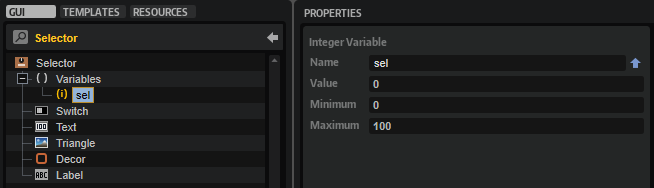
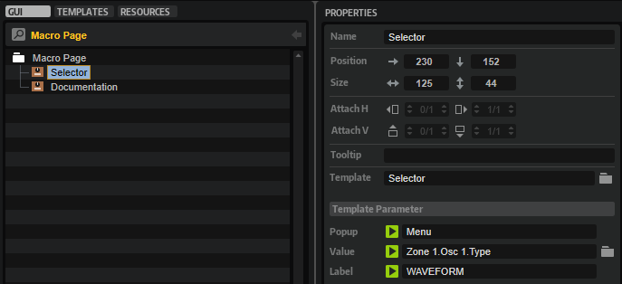
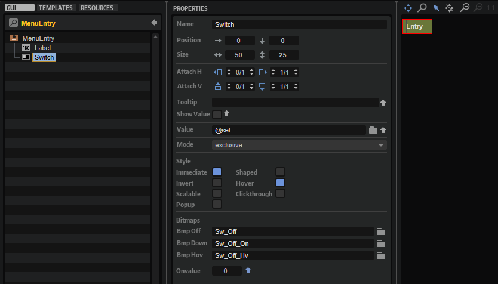
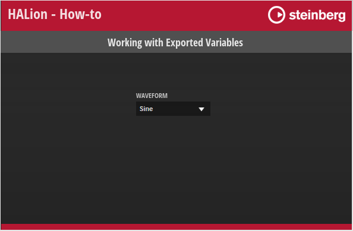
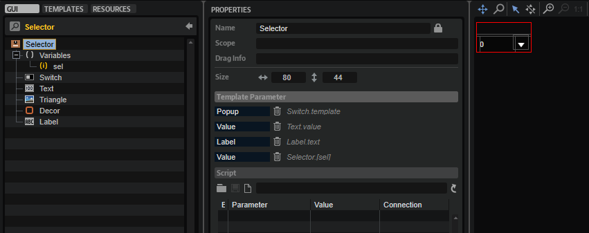
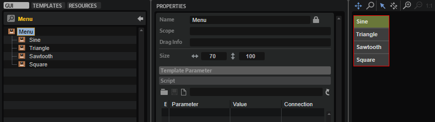

/ [HALion Developer Resource](../../HALion-Developer-Resource.md) / [HALion Tutorials & Guidelines](./HALion-Tutorials-Guidelines.md) / [Tutorials](./Tutorials.md) /

# Working with Exported Variables

---

**On this page:**

[[_TOC_]]

---

UI variables can be defined within any template. The UI variables inside a template can be used to connect multiple controls, for example. By exporting the value of a property and the UI variable itself to the same template parameter, you create an interface for connecting engine parameters outside of the template to the property and UI variable within the template. The subsequent example illustrates this with a single-level popup menu. An example of a multi-level popup menu using an exported variable can be found in [Custom Multi-Level Menu II](./Custom-Multi-Level-Menus-II.md).

## Overview

In this example, there is one exported UI variable. Look for the the ``sel`` UI variable inside the [Selector](#selector) template.

Within the [Selector](#selector) template the ``sel`` UI variable and the Value property of the [Text](../../HALion-Macro-Page/pages/Text.md) control are exported both as 'Value'. This creates the interface for connecting the engine parameter, the oscillator type of Zone 1 in this case.

The Value property of the [MenuEntry](#menuentry) template has the ``sel`` UI variable assigned. Through this the currently selected value will be sent to the [Selector](#selector) template which is connected to the engine parameter and the [Text](../../HALion-Macro-Page/pages/Text.md) control within the [Selector](#selector) template shows the display string of the engine parameter.

## Example VST Preset

* [Working with Exported Variables.vstpreset](../vstpresets/Working%20with%20Exported%20Variables.vstpreset)

**To explore the templates in this example:**

1. Load [Working with Exported Variables.vstpreset](../vstpresets/Working%20with%20Exported%20Variables.vstpreset).
1. Open the **Macro Page Designer**, go to the **Templates Tree** and select the template you want to explore. 
1. Click **Edit Element**  to examine the template.

## Single-Level Popup Menu

The single-level popup menu is implemented through a combination of a Selector, a Menu and a MenuEntry template. The Selector template opens the Menu template for selecting the values and contains the controls for displaying the display string of the connected engine parameter. The Menu template contains four MenuEntry templates which represent the values you can select.

## How the Elements Interact

### Selector

The Selector template contains the elements which are required to open the [Menu](#menu) template and display the selected value.

#### UI Variables

|Variable|Description|Type|
|:-|:-|:-|
|**sel**|This variable is used by all menu entries of the popup menu. ``sel`` is exported as 'Value' and combined with the Value property of the [Text](../../HALion-Macro-Page/pages/Text.md) control. Through this the display string of the connected engine parameter will be displayed instead of the integer value.|Integer|

#### Controls and Subtemplates

|Element|Description|
|:-|:-|
|**Switch**|A [Switch](../../HALion-Macro-Page/pages/Switch.md) control that opens the popup menu. Its Popup Template property is exported as 'Popup'. This allows you to select which popup menu to open for each instance of the Selector template.|
|**Text**|A [Text](../../HALion-Macro-Page/pages/Text.md) control for displaying the display string of the connected engine parameter.  This is achieved by exporting the Value property as 'Value'. Since the ``sel`` UI variable is also exported as 'Value', both are combined into one template parameter, creating the interface for connecting the engine parameter.|
|**Triangle**|An [Image](../../HALion-Macro-Page/pages/Image.md) control to indicate that a popup menu can be opened.|
|**Decor**|A [Decor](../../HALion-Macro-Page/pages/Decor-Control.md) control used as background.|
|**Label**|A [Label](../../HALion-Macro-Page/pages/Label.md) control for displaying the name of the connected parameter. Its Text property is exported as 'Label'. This allows you to name the Selector template differently for each instance.|

### Menu

The Menu template contains four [MenuEntry](#menuentry) templates that define the entries of the menu.

|Element|Description|
|:-|:-|
|**Sine, Triangle,Saw, Square**|These represent the four entries of the submenu. They use the [MenuEntry](#menuentry) template which defines the look and functionality of an entry. The OnValue parameter of each [MenuEntry](#rootmenuentry) template must be set to the corresponding value of the engine parameter it selects. This value will be sent to the `sel` variable. See [MenuEntry](#rootmenuentry) and [Selector/UI Variables](#ui-variables) for details. The Label parameter defines the name of the entry to be displayed in the menu.|

### MenuEntry

This template represents one entry in the [Menu](#menu) template. It consists of two elements:

#### Controls and Subtemplates

|Element|Description|
|:-|:-|
|**Label**|A [Label](../../HALion-Macro-Page/pages/Label.md) control to display the name of the menu entry. Its Text property is exported as 'Label'. This allows you to name the template differently for each instance.|
|**Switch**|A [Switch](../../HALion-Macro-Page/pages/Switch.md) control with exclusive mode. The OnValue property is exported to be set by each instance of the template. See [Menu](#submenu) for details. The Value property must be set to `@sel`, the [UI variable](#ui-variables) of the [Selector](#selector) template. The OnValue will be sent to the Value parameter which is sent to the ``sel`` variable. Through this the currently selected value will be sent to the [Selector](#selector) template which is connected to the engine parameter and the [Text](../../HALion-Macro-Page/pages/Text.md) control within the [Selector](#selector) template shows the display string of the engine parameter.|
